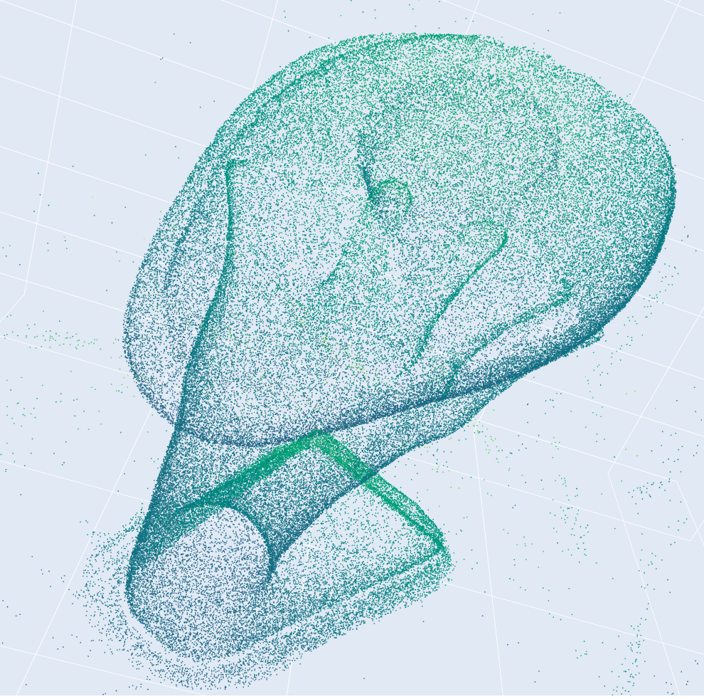

# 3D Metrology Reconstruction Engine

A high-performance C++17 engine for 3D reconstruction using calibrated structured light patterns. This project focuses on high-precision metrology by triangulating correspondences between a camera and a projector.

<div align="center">
  
| 2D Pattern Projection (Input) | 3D Point Cloud (Output) |
|:---:|:---:|
|  |  |

</div>

## Key Features

- **Gray Code Decoding**: Robust decoding of binary-coded structured light patterns.
- **Camera/Projector Calibration**: Full support for intrinsic matrices and lens distortion coefficients.
- **Geometric Triangulation**: Fast computation of 3D point clouds from 2D pixel-to-pixel matches.
- **Sparse Point Clouds**: Efficient handling and export of high-density geometric data.

## Performance Comparison: C++ vs Python

The C++ engine was built to handle millions of points per scan with industrial-level throughput. Below is a benchmark comparing the optimized C++ engine against the original Python (NumPy) implementation on an **Apple M2 Max (Position 0)**.

| Metric | Python (NumPy) | C++ (Optimized) | **Improvement** |
| :--- | :--- | :--- | :--- |
| **Decoding Time** | ~13.0s | **~8.6s** | **1.5x Absolute** |
| **Point Density** | ~450K points | **~9.3M points** | **20x More Data** |
| **Triangulation Speed** | 0.89 $\mu$s/pt | **0.18 $\mu$s/pt** | **4.9x Faster** |
| **Total Throughput** | ~33.8 $\mu$s/pt | **~1.1 $\mu$s/pt** | **30x More Efficient** |

### How We Achieved This Boost

To achieve a **30x throughput improvement**, the engine uses several high-performance C++ techniques:

1.  **Multi-threaded Parallelism (OpenMP)**:
    - We parallelized the decoding loops and the triangulation step across all available CPU cores.
    - Used **thread-local "bucket" storage** for matches to prevent "mutex-locking" (contention) which usually kills multi-threaded performance.
2.  **Hardware-Level Vectorization (SIMD)**:
    - Compiled with **`-O3 -march=native`** to allow the compiler to use specific ARM NEON instructions.
    - Leveraged **Eigen's optimized math routines**, allowing the CPU to process 4-8 coordinates in a single clock cycle.
3.  **Memory Management**:
    - Pre-allocated large vectors using `.reserve()` to avoid expensive memory reallocations during processing.
    - Used an **Array-of-Structures (AoS)** layout that fits neatly into CPU L1/L2 caches.
4.  **Binary I/O Optimization**:
    - Replaced text-based PLY writing with **Direct Binary Buffer dumps**. Writing 9 Million points now takes milliseconds rather than seconds.


## Building the Engine

The C++ engine requires **OpenCV**, **Eigen**, and a C++17 compiler.

```bash
mkdir build && cd build
cmake ..
make -j8
```

## Usage

After building the engine, use the provided Python scripts to automate the multi-view reconstruction and merge.

```bash
# 1. Run full 360° reconstruction
python3 scripts/run_all.py

# 2. Generate interactive 3D visualization
python3 scripts/visualize_interactive.py --input media/full_model.ply
```

## Data Source

The algorithms and test data are based on the [Scanner-Sim](https://geometryprocessing.github.io/scanner-sim/) project, which provides a comprehensive dataset and simulator for structured light 3D metrology.
