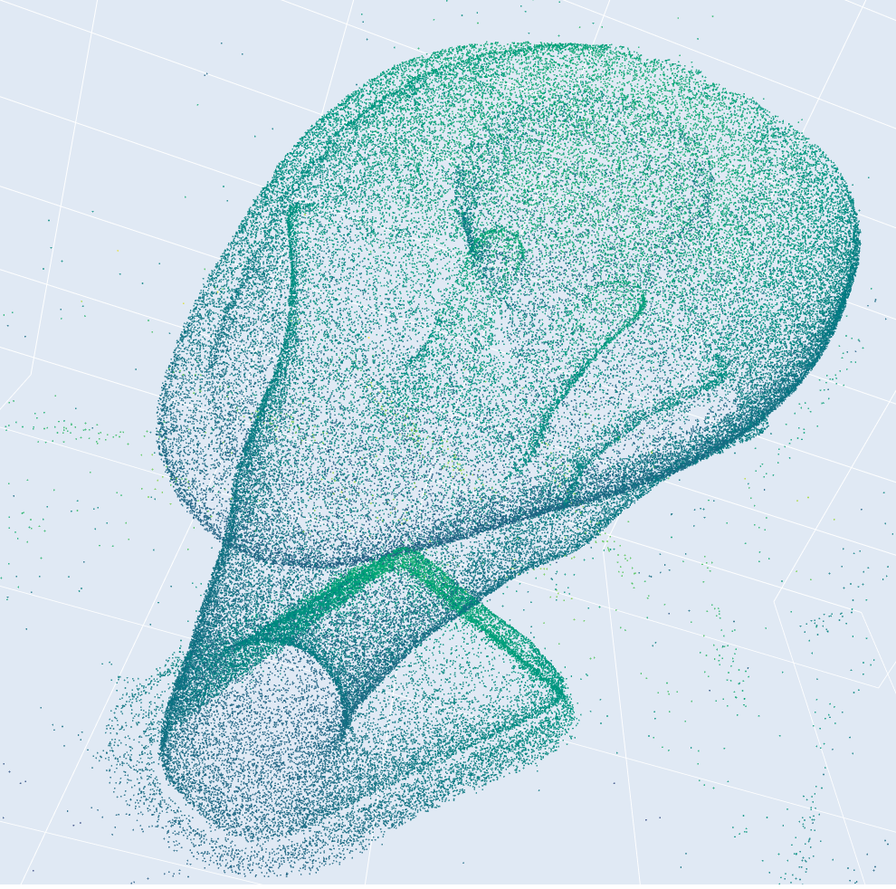

# 3D Metrology Reconstruction Engine

A high-performance C++17 engine for 3D reconstruction using calibrated structured light patterns. This project focuses on high-precision metrology by triangulating correspondences between a camera and a projector.

<div align="center">
  
| 2D Pattern Projection (Input) | 3D Point Cloud (Output) |
|:---:|:---:|
|  |  |

</div>

## Key Features

- **Gray Code Decoding**: Robust decoding of binary-coded structured light patterns.
- **Camera/Projector Calibration**: Full support for intrinsic matrices and lens distortion coefficients.
- **Geometric Triangulation**: Fast computation of 3D point clouds from 2D pixel-to-pixel matches.
- **Sparse Point Clouds**: Efficient handling and export of high-density geometric data.

## Performance Comparison: C++ vs Python

The C++ engine was built to handle millions of points per scan with industrial-level throughput. Below is a benchmark comparing the optimized C++ engine against the original [Python (NumPy) implementation](https://github.com/geometryprocessing/scanner-sim) on an Apple M4.

| Metric | Python (NumPy) | C++ (CPU) | C++ (Metal GPU) | Improvement (GPU vs CPU) |
| :--- | :--- | :--- | :--- | :--- |
| **Point Density** | ~454K points | ~9.28M points | ~9.28M points | Equivalent |
| **Triangulation Time**| 0.89 µs/pt | 0.18 µs/pt | 0.04 µs/pt | **4.5x** |
| **Total Latency** | ~29.5 µs/pt | ~1.11 µs/pt | ~0.25 µs/pt | **4.4x** |

### How We Achieved This Boost

To achieve a **118x total throughput improvement** over Python (and a 4.4x boost over optimized C++ CPU), the engine uses several high-performance techniques:

1.  **Metal GPU Acceleration (Apple Silicon)**:
    - **Zero-Copy Memory**: Allowing the CPU and GPU to access the same physical memory without expensive copying.
    - **Parallel Triangulation**: Offloaded lens-undistortion and ray-intersection calculations to GPU threads.
2.  **Multi-threaded Parallelism (OpenMP)**:
    - When running on CPU, we parallelize the decoding and triangulation logic across all available cores.
    - Used thread-local storage for variable-length result sets to eliminate mutex contention.
3.  **Hardware-Level Vectorization (SIMD)**:
    - Leveraged Eigen's optimized math routines and ARM NEON intrinsics to process multiple coordinates per clock cycle.
4.  **Optimized Memory Layout**:
    - Pre-allocated large point cloud vectors and used flattened data structures to ensure cache-friendly sequential memory access.

## Building the Engine

The C++ engine requires **OpenCV**, **Eigen**, and a C++17 compiler.

```bash
mkdir build && cd build
cmake ..
make -j8
```

## Usage

After building the engine, use the provided Python scripts to automate the multi-view reconstruction and merge.

```bash
# 1. Run full 360° reconstruction (Defaults to GPU on Mac)
python3 scripts/run_all.py

# To force CPU-only mode on Apple Silicon:
USE_CPU_ONLY=1 python3 scripts/run_all.py

# 2. Generate interactive 3D visualization
python3 scripts/visualize_interactive.py --input media/full_model.ply
```

## Data Source

The algorithms and test data are based on the [Scanner-Sim](https://geometryprocessing.github.io/scanner-sim/) project, which provides a comprehensive dataset and simulator for structured light 3D metrology.
